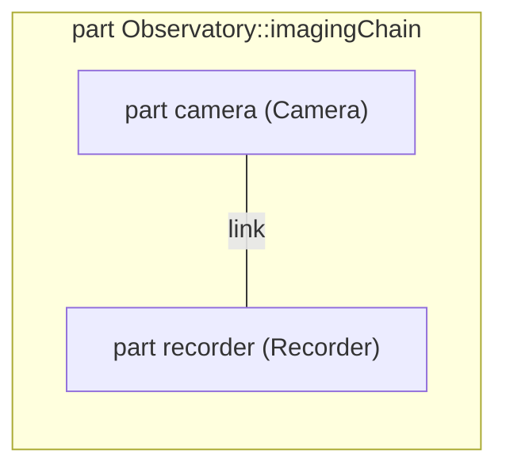
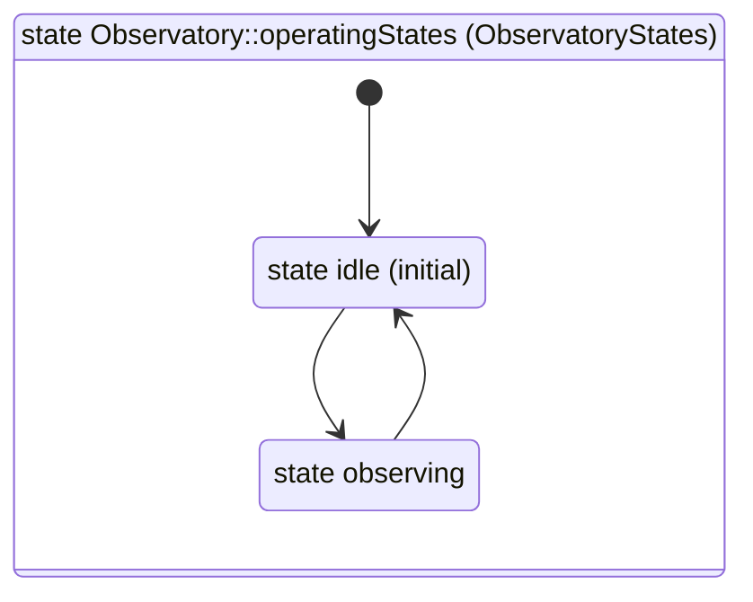

# Telescope Mass Report

Mass rollup for the telescope assembly. Masses are in kg \| not \#grams, \*not\* \_lbs\_, \`raw\`, \<b>\&plain\</b>.

## Subsystem Masses \| by \*name\*

*All subsystems by mass*

| name | mass |
| --- | --- |
| baffle\|shroud \*tricky\* | 1.5 |
| mount | 15 |
| optics | 8.5 |
| segmentControl | 20 |

### Heavy Subsystems

mount segmentControl

1. mount
2. segmentControl

### Missing Subsystems

| name | mass |
| --- | --- |

## Diagrams

*Imaging chain interconnection*

*Observatory states, left to right*

## Declared Types

The declared type of the telescope, by relationship traversal.

*Type of telescope*

| element |
| --- |
| Observatory::Assembly \*frame\* |

- Assembly \*frame\*
